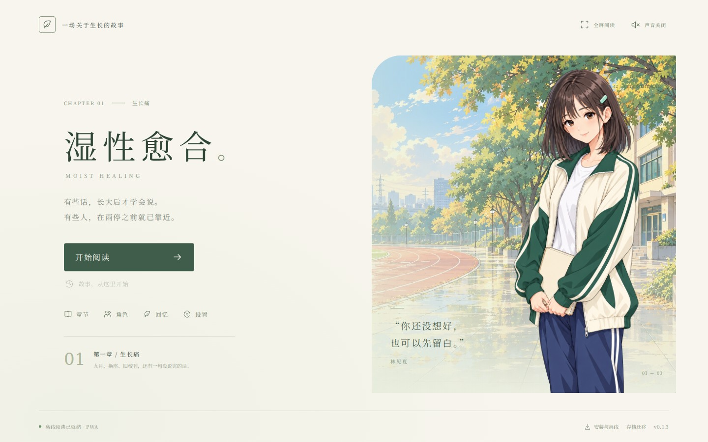

# 湿性愈合

> 有些话，长大后才学会说。有些人，在雨停之前就已靠近。

青春期校园题材原创视觉小说。第一章 **《生长痛》** 已实现，当前版本 **v0.1.1**。

[在线游玩 / 安装 PWA](https://aureliuswu.github.io/Project1/) · [下载 Windows / PWA](https://github.com/AureliusWu/Project1/releases/tag/v0.1.1)

你扮演江城七中高二学生程屿，在一次月考后的换座中，与林见夏和陈知遥相遇。成绩、家庭期待、文学社与一场没有说完的争执，构成九月的这个下午。



| 预览 | 电脑 | 手机 |
| --- | --- | --- |
| 标题界面 | [查看](docs/previews/title-desktop.jpg) | [查看](docs/previews/title-mobile.jpg) |
| 实际阅读 | [查看](docs/previews/reading-desktop.jpg) | [查看](docs/previews/reading-mobile.jpg) |

## 可玩的内容

- 完整第一章，4 次关键选择，54 种选择组合，3 种章节结局。
- 两位主要角色的原创 AI 立绘、两张原创 AI 校园背景。
- 逐字文本、自动阅读、快进、已读回看、结局回忆手册。
- 自动存档 + 3 个手动存档位；JSON 导入/导出，在手机与电脑之间迁移进度。
- 横屏/竖屏响应布局、键盘操作、减少动态效果选项。
- 安装说明、完整离线下载状态、下载失败重试与版本检查。
- 原创 Web Audio 轻音乐；无账号、无 API 密钥、无运行时外部请求。

## 两个客户端，一套游戏

| 客户端 | 运行方式 | 离线支持 | 存档 |
| --- | --- | --- | --- |
| 手机 / 电脑 PWA | HTTPS 网站安装到主屏幕或桌面 | 首次缓存全部资源后可断网重开 | 浏览器本地存储，可导出迁移 |
| Windows 桌面 | Electron 安装包 / 便携 EXE | 所有资源随安装包提供 | 应用本地存储，可导出迁移 |

这是共用代码与数据格式的双端实现。当前版本不包含账户云同步。

## 开发与游玩

需要 Node.js 24（或满足 Vite 8 要求的 Node.js 22.12+）。

```bash
npm ci
npm run dev
```

浏览器打开终端显示的地址。测试生产 PWA：

```bash
npm run build
npm run preview
```

localhost 可测试 Service Worker；手机实际安装需要 HTTPS。

桌面版：

```bash
npm run desktop       # 构建并启动桌面客户端
npm run desktop:pack  # 输出未打包目录
npm run desktop:win   # 在 Windows 生成 NSIS 安装包和便携 EXE
```

`release/`、`dist/` 和依赖目录不进入 Git。发布包通过 Actions 生成。

## 下载与部署

直接打开 [游戏网页](https://aureliuswu.github.io/Project1/)，标题页的「安装与离线」提供安装操作、下载状态与更新检查。离线状态就绪后可以断网重开。

[版本下载页](https://github.com/AureliusWu/Project1/releases/tag/v0.1.1) 提供 Windows 安装版、便携版及 PWA ZIP，包含文件 SHA-256 与实际构建提交记录。该下载不依赖 Actions 产物保留期限。

每次推送 `main` 会运行 [Build game](https://github.com/AureliusWu/Project1/actions/workflows/build.yml)：先验证剧情与手机/电脑 PWA，再在 Windows 启动实际 Electron 程序、生成安装包并启动实际打包程序复验。全部成功后，对应版本的安装包和 PWA 会发布到 Releases。需要发布新版本时，同时更新 `package.json`、锁文件与 `docs/releases/v版本号.md`；已发布版本不被覆盖。对应运行页面也保留 Artifacts：

- `MoistHealing-PWA`：完整静态网页包。
- `MoistHealing-Windows-x64`：NSIS 安装包与便携 EXE。

仓库已启用 GitHub Pages。[Publish PWA](https://github.com/AureliusWu/Project1/actions/workflows/pages.yml) 在完整构建验证成功后自动部署该次构建的 PWA 包，随后检查实际网站的手机/电脑游玩、存档及离线重开。也可以手动运行该流程。

仓库 Settings → Pages 的 Source 应选择 **GitHub Actions**，以保证只发布构建产物。使用 `main` 分支目录发布会载入开发源码，无法直接运行游戏。

还可以把 `dist/` 部署到任意 HTTPS 静态主机。采用相对路径，支持子目录部署。网页的新版本完整下载后会显示提示，关闭所有游戏窗口再打开时接管，保留当前存档。

## 操作

| 操作 | 键盘 / 触屏 |
| --- | --- |
| 显示完整段落 / 下一段 | 空格、Enter、右方向键，或点击画面/文本 |
| 自动阅读 | A，或「自动」 |
| 存档 | S / Esc，或「存档」 |
| 回看 | L，或「回看」 |
| 桌面全屏 | F11 |

快进与自动阅读都会在选择处停下。回到标题会保留进度；开启新故事前会提示自动存档将更新。

## 验证

```bash
npm test
npm run build
npx playwright install chromium
npm run test:e2e
npm run test:desktop
npm run test:desktop:packaged # Windows 打包后，检查实际 ASAR 桌面程序
```

剧情校验遍历全部 54 条路线，并验证每段可恢复、全部场景可达、非法存档被拒绝。浏览器测试覆盖两个屏幕规格下的完整游玩、存档、迁移、离线重开与短横屏布局。桌面启动检查验证实际窗口、立绘资源、剧情启动、自动存档和渲染器隔离。

详见 [技术结构](docs/ARCHITECTURE.md)、[第一章设计](docs/STORY.md)、[素材与提示词](docs/prompts/ART.md) 和 [验证记录](docs/VALIDATION.md)。

## 授权

项目代码和原创文本使用 [MIT](LICENSE)。AI 美术来源与生成记录见素材文档。游戏内字体使用 Noto Serif SC 子集，遵循 [SIL Open Font License](docs/OFL-NotoSerifSC.txt)。两份许可文本也随 PWA 和桌面包提供于 `licenses/`。
